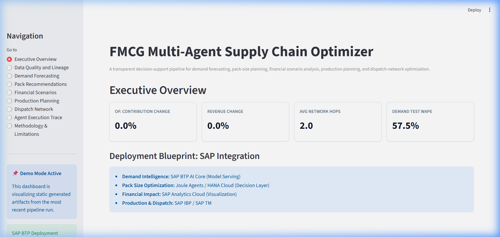
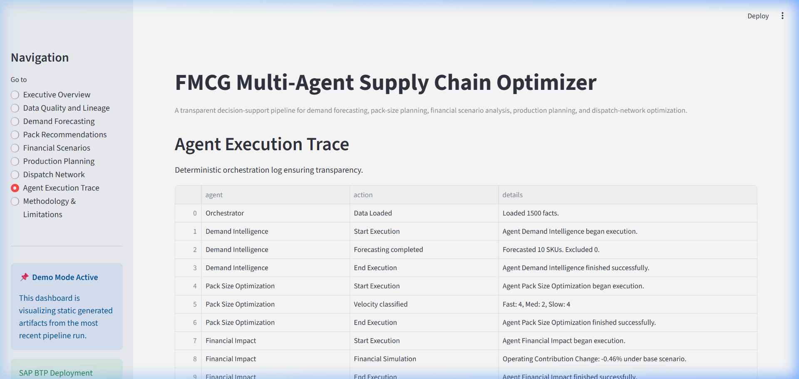

# FMCG Multi-Agent Supply Chain Optimizer


[](https://github.com/raywincruz07-collab/fmcg-multi-agent-supply-chain-optimizer/actions/workflows/ci.yml)

**Repository maintained and professionally refactored by Raywin Cruz. Original implementation contributions by Namrath Basavaraju.**

This repository contains a deterministic decision-support orchestration pipeline for FMCG supply chains. It simulates data processing across five distinct stages: Demand Forecasting, Pack Size Optimization, Financial Impact Analysis, Production Planning, and Dispatch Network Routing.

## Dashboard Preview



## Features

- **Demand Intelligence:** Compares Random Forest against robust time-series baselines (Naive, Seasonal Naive, Rolling Mean) using a Chronological train-validation-test evaluation, where validation performance selects the model and the untouched test period reports final performance.
- **Pack-Size Recommendations:** Provides actionable packing guidelines constrained by Minimum Order Quantities (MOQs) and case-multiples.
- **Financial Scenario Modelling:** Generates Conservative, Base, and Optimistic revenue and operating-contribution scenario estimates.
- **Production & Dispatch:** Simulates capacity-constrained Economic Order Quantity (EOQ) targets and true NetworkX graph routing.
- **Transparent Execution Trace:** Orchestrator logs all deterministic decisions without artificial benchmark clamping or LLM "hallucinations."
  <br>
  
- **Demo Dashboard:** A clean Streamlit application reading purely from generated artifacts, eliminating execution latency in the presentation layer.

## Architecture & Blueprint

This repository serves as an integration blueprint. In a production environment:
- **Demand Intelligence:** Deployed via **SAP BTP AI Core** (Model Serving).
- **Pack Size Optimization:** Executed via **SAP HANA Cloud / Joule Agents** (Decision Layer).
- **Financial Impact:** Visualized within **SAP Analytics Cloud**.
- **Production & Dispatch:** Handled by **SAP IBP** and **SAP TM**.

> [!NOTE]
> **No live SAP connection exists.** This project acts as a standalone simulation and conceptual blueprint for what an SAP-integrated agentic supply-chain might look like.

## Quickstart

This application is built to run immediately for demonstration purposes.

```bash
# 1. Clone the repository
git clone https://github.com/raywincruz07-collab/fmcg-multi-agent-supply-chain-optimizer.git
cd fmcg-multi-agent-supply-chain-optimizer

# 2. Install dependencies
pip install -e .

# 3. Launch the Dashboard
streamlit run app/streamlit_app.py
```

> [!IMPORTANT]
> **Default dashboard mode uses committed generated demonstration artifacts** located in `demo_artifacts/`. To run the pipeline yourself, execute `python scripts/run_pipeline.py --config configs/default.yaml`. Runtime pipeline outputs go to the git-ignored `artifacts/` directory.

## Datasets

The default demonstration uses generated data following a **SupplyGraph-inspired schema**. Due to size limitations and licensing, the original SupplyGraph (Wasi et al., AAAI 2024) raw datasets are not included. The pipeline gracefully falls back to generating a coherent, valid sample dataset if the raw source is missing.

To run with the real dataset:
1. Review the data layout instructions in `scripts/download_data.py`.
2. Place the `Temporal Data` and `Nodes` directories into `data/raw/supplygraph/`.

## Project Structure

```text
├── .github/workflows/    # CI Pipeline
├── app/                  # Streamlit Dashboard (Presentation layer)
├── demo_artifacts/       # Lightweight committed artifacts used by the default dashboard
├── artifacts/            # Local pipeline outputs, ignored by Git
├── assets/               # Recruiter-facing dashboard screenshots
├── configs/              # Scenario definitions (default.yaml)
├── data/                 # Sample generated data and raw directories
├── docs/                 # Documentation and methodology
├── scripts/              # Pipeline execution and data generation
├── src/fmcg_supply_chain/
│   ├── agents/           # The 5 pipeline agents
│   ├── data/             # Dimensional data loaders
│   └── orchestration/    # Orchestrator and state tracking
└── tests/                # Pytest unit and integration tests
```

## Results & Transparency

- **Forecasting:** Baselines (e.g., Seasonal Naive, Rolling Mean) frequently outperform Random Forest for several SKUs. The pipeline honestly selects the best model per SKU based on validation set performance.
- **Financial Scenarios:** Financial results are scenario estimates configured via `configs/default.yaml`, not observed historical outcomes. 
- **Routing:** Dispatch results are graph-based scenario outputs calculated via shortest-path algorithms over a constrained graph.
